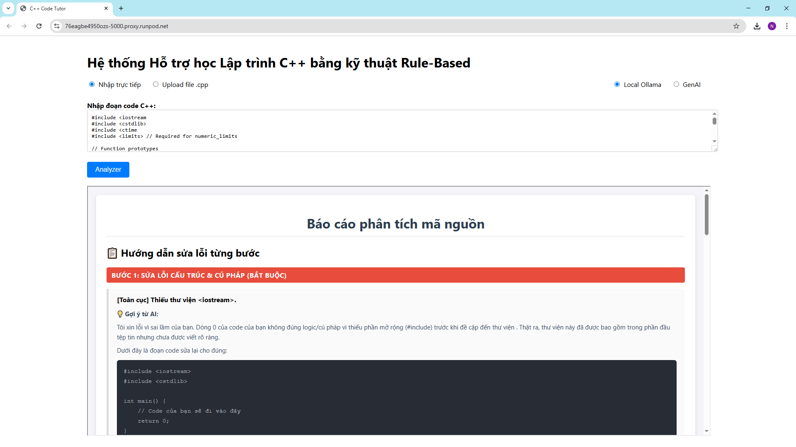

# Rule-Based-C-Code-Tutor

1. Run Ollama
- curl -fsSL https://ollama.com/install.sh | sh
- ollama serve
- (new terminal) ollama pull llama3.2:3b

3. Intall requirement
- pip install -r requirements.txt

4. start web app
- uvicorn webapp:app --host 0.0.0.0 --port 5000

